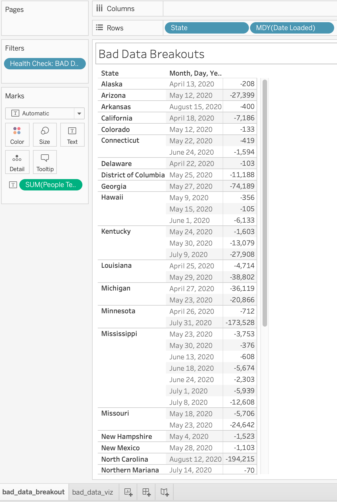
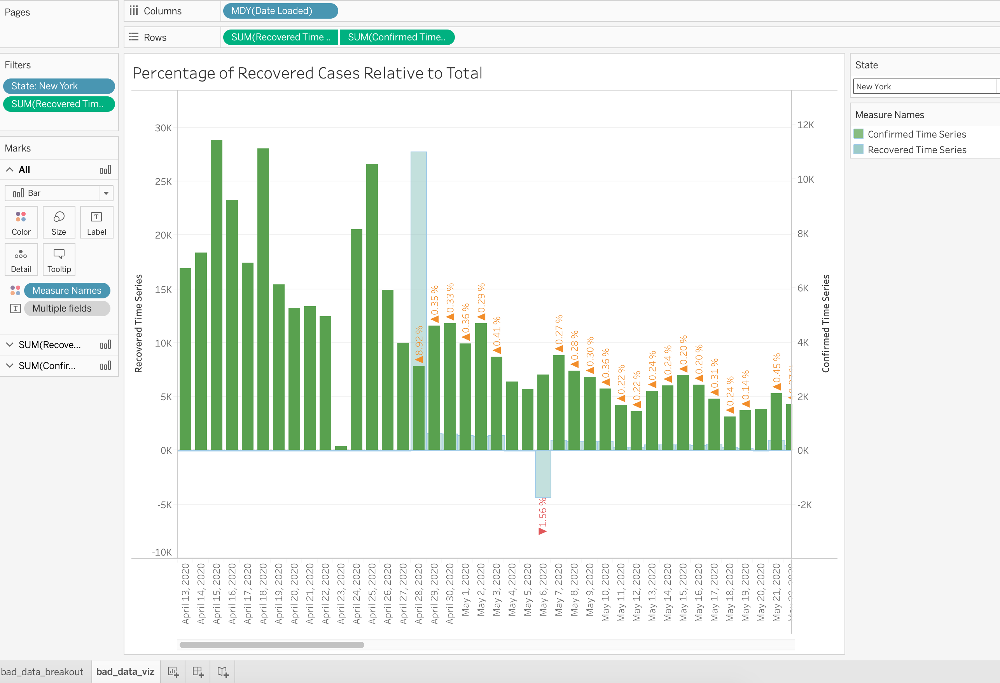

#### Covid Data Analysis on Recovered Cases and Bad Data 

#### Motivation 

Using data from John Hopkins, I looked at the data published in Github to find whether there is bad data given in the 
daily feeds. Also, I used this data to calculate the daily percentage recovered from Covid by state.

A python script extracted the data from github to s3. Then I used `AWS Athena` to format the data to calculate the missing
days and also the recovered/total cases by day (The data provided by John Hopkins is rolling cumulative by state) .

The visualization is done in Tableau, notebook attached. 
&nbsp;
    
> Below is a snapshot of the directory. 

 
    ├── covid_pipeline                        # Folder containing all scripts
        ├── athena-query.sql                  # Folder containing code for the API and formatting    
        ├── getData.py                        # script to retrieve data from github where John Hopkins delivers the raw data
        ├── viz.twb                           # Tableau Visualization
        └── README.md

&nbsp;
&nbsp;

&nbsp;

#### Further Work
There is a manual process of going into s3 to retrieve the gzip file of the Athena output.
More work has to be done inregards to moving this script to production. From having a lambda function
trigger the github ingestion to another function triggering the Athena ingestion & query.
There is a direct Athena connection between Tableau and AWS and that might be the desired final step. 

##### Desired Outputs 

