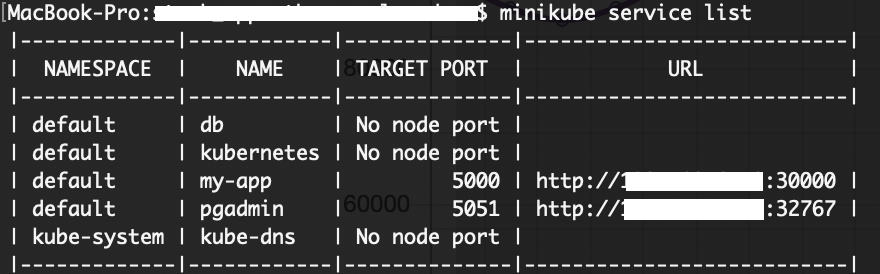
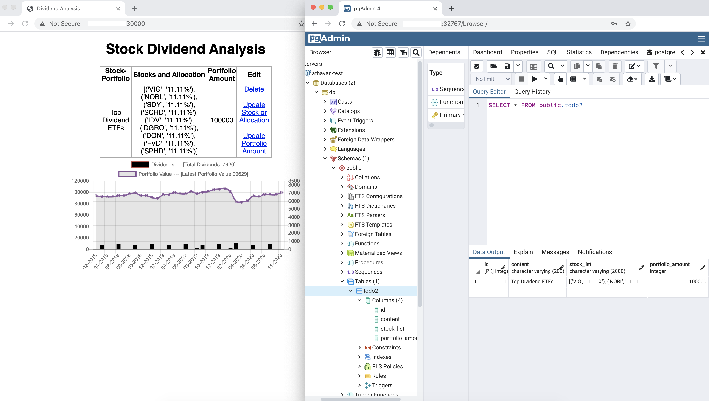

#### Dividends Over Time -- Flask App on Kubernetes 


#### Motivation of App (main focus on devOps)

Using the AlphaVantage's API to retrieve data on stocks selected by individuals in the  Financial 
World; I created an app that calculates the value of a portfolio over time as well as
the dividends received for those stocks. I use this as a benchmark when investing stocks.
  
The goal of this apps is to understand the deployment phase of moving an application
to production using Kubernetes. There are three services that are used; `flask-app`,
`postgres` and `pgadmin`.  I will be using Kubernetes to create three different
deployments that can listen to each other when data is transferred.

Ultimately, this project is for me to better understand the infrastructure and commands of kubernetes.
The bigger project is to move an Airflow pipeline into a Kubernetes environment, with tasks of any Dags running
on separate pods.
 
&nbsp;
    
> Below is a snapshot of the directory. 

 
    ├── stock_app                             # Folder containing all scripts
        ├── alpha_api/                        # Folder containing code for the API and formatting    
        ├── static.css/                       # css code
        ├── templates/                        # Flask HTML files.
        ├── app.py                            # python script to execute application
        ├── Dockerfile                        # DockerFile used to deploy app.
        ├── requirements.txt                  # requirements
        ├── stock-app-kube.yaml               # yaml file to create all deployments,pods, replicasets (used kompose to convert)
        ├── stock-run.yaml                    # docker-compose file to run on one machine.
        └── README.md


&nbsp;
&nbsp;

>> Code to push DockerFile into AWS ECR repo. 
```bash
# create Repository in AWS ECR 
repo_url="aws ecr url"
aws ecr get-login-password --region us-east-2 | docker login --username AWS --password-stdin ${repo_url}

local_build_with_tag="my-app:1.0"
docker build -t ${local_build_with_tag} .
ecr_build_with_tag="my-app:1.0"

docker tag ${local_build_with_tag} ${repo_url}/${ecr_build_with_tag}
docker push ${repo_url}/${ecr_build_with_tag}

 
```


&nbsp;


>> Code for minikube and kubernetes. 
```bash

minikube start --vm-driver=hyperkit

repo_url="aws ecr url"

#key to pull in yaml file is athavan-key

kubectl create secret docker-registry athavan-key --docker-server=https://${repo_url} --docker-username=AWS --docker-password=pwd

#kompose convert -f stock-run.yaml -o stock-app-kube.yaml

#create all deployments
kubectl create -f stock-app-kube.yaml

#get pod name
kubectl get pods -o wide

app_pod_name="get pod name from above"
kubectl describe pod ${app_pod_name}

#find endpoints of all services in minikube
minikube service list
```
&nbsp;

##### Desired Outputs 


